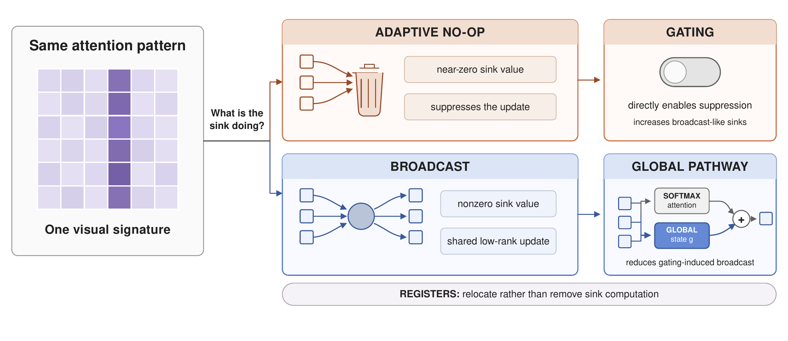

<div align="center">

# A Unifying View of Attention Sinks: From Mechanisms to Architectural Interventions



[](https://arxiv.org/abs/2606.08105)

[**Lukas Fesser**](https://lfesser97.github.io)<sup>★†</sup> &nbsp; [**Mozes Jacobs**](https://mozesjacobs.github.io)<sup>★†</sup> &nbsp; [**Thomas Fel**](https://thomasfel.me)<sup>★†</sup> &nbsp; [**Andy Keller**](https://akandykeller.github.io) &nbsp; [**Sham Kakade**](https://shamulent.github.io)

<small>

**Kempner Institute, Harvard University**

★ Equal contribution. &nbsp; † Corresponding authors.

</small>

</div>

---

**tl;dr** Attention sinks in softmax transformers can hide two distinct algorithms: *adaptive NOP* (a head suppresses its update by routing to a null token) and *broadcast* (a sink aggregates and redistributes global information). Gating eliminates detected NOP-like sinks but increases broadcast-like sinks, registers relocate rather than remove sink computation, and an explicit position-free global pathway gives shared communication its own route.

---

## Abstract

When attention concentrates on a single token, a sink, what is the model actually computing? Attention sinks are ubiquitous in softmax transformers, yet this shared visual signature can hide fundamentally different algorithms. We show that visually similar sink patterns can reflect two distinct mechanisms: (i) adaptive NOP, where a head suppresses its update by routing to a null token, and (ii) broadcast, where a sink aggregates and redistributes global information. Each mechanism leaves distinct traces (NOP sinks exhibit negligible value norms; broadcast sinks induce low-rank outputs), which we formalize on synthetic tasks and use to derive practical diagnostics. Applied to pretrained vision transformers, these diagnostics reveal that both mechanisms exist at scale: sinks transition from CLS in early layers to patches in deeper layers and concentrate in specialized heads. Causal interventions further connect these signatures to near-null suppression and shared residual contributions. We then use architectural alternatives to show how these computations can be reorganized: gating eliminates detected NOP-like sinks but increases broadcast-like sinks, registers relocate rather than remove sink computation, and our position-free global pathway provides an explicit route for shared communication that reduces the broadcast-like sinks induced by gating. On dense probes, combining gating with the global pathway gives the strongest results among the tested variants, despite retaining some broadcast-like sinks. Overall, we find that the same attention pattern can reflect two very different computations, and that effective intervention depends not only on identifying the computation, but also on providing architectural alternatives through which the model can reorganize it.

## Overview

The repository has one LeJEPA training codebase (`src/`) and one directory per experiment. Each directory has its own README with commands, resources and the exact settings.

| paper | what | code |
|---|---|---|
| Table 1 | ImageNet online probe + ADE20K / VOC 2012 cached-feature linear probes of Baseline, Gating, Global + Penalty, Gating + Global + Penalty (one backbone each, seed 9000, epoch-50 checkpoints) | [`runs/run_mitigation.sh`](runs/run_mitigation.sh), [`src/`](src/README.md), [`cached_probes/`](cached_probes/README.md) |
| Section 5 "Architectural Interactions in ViT-L"; App. tables "Sinks per image" and "Sensitivity to the sink rule" | sink counts in the four Table-1 models (1,984 ADE20K images) | [`lejepa_sinks/`](lejepa_sinks/README.md) |
| Section 5 "Controlled-Task Results"; Figure 7B | two-layer broadcast task: attention vs global pathway vs global pathway + penalty, 5 seeds | [`toy/global_pathway/`](toy/global_pathway/README.md) |
| Figure 7 | A: DINOv2-G + registers sink signatures; B: controlled broadcast task | [`figures/fig7_mitigation.py`](figures/fig7_mitigation.py) (inputs from `vit_causal/` Stage 1 and `toy/global_pathway/`) |
| Figure 6 / Figure 18, "Causal Validation in Pretrained ViTs" | single-head causal interventions on NOP-like and broadcast-like sinks in DINOv2 ViT-L/g (+ registers) | [`vit_causal/`](vit_causal/README.md), [`figures/fig6_causal_interventions.py`](figures/fig6_causal_interventions.py) |
| App. A.3 (Table 2, Figure 8), App. A.4 (Table 3, Figures 9-10), App. E.1 (Figure 19), Figures 2B and 11 | toy NOP and broadcast models: causal interventions, pathway relocation, sink-formation dynamics | [`toy/notebooks/`](toy/notebooks/README.md) |
| App. register and gating sweep (ImageNet and dense-probe tables) | six LeJEPA variants (baseline / registers / elementwise / headwise gating, with and without registers) x 3 seeds, augmented probes | [`runs/run.sh`](runs/run.sh), [`ade20k_probes/`](ade20k_probes/), [`pascal_voc_2012_probes/`](pascal_voc_2012_probes/), [`src/aggregate_probe_results.py`](src/aggregate_probe_results.py) — see [below](#appendix-sweep-six-lejepa-variants) |

The register and gating sweep and the Table 1 models are separate runs with different probe protocols; their numbers are not comparable (see the appendix).

> The LeJEPA training code in this repo was adapted from <https://github.com/galilai-group/lejepa>.

## Setup

### Environment

To run the code, you will need to create a mamba (or conda) environment from the `environment.yml` file. Create and activate the environment with

```bash
mamba env create -f environment.yml
mamba activate attn_sink_env2
```

### Paths

Edit `src/paths.py`, `ade20k_probes/paths.py`, and `pascal_voc_2012_probes/paths.py` so the absolute paths point to your ImageNet train/val splits, the model checkpoint directory, and the ADE20K / Pascal VOC roots. The newer experiments have their own `paths.py` (or CLI arguments): `cached_probes/`, `lejepa_sinks/`, `vit_causal/`.

### Pascal VOC dataset (sweep probes)

Pascal VOC 2012 is fetched via `kagglehub` (needs Kaggle credentials):

```bash
cd pascal_voc_2012_probes
python download_data.py
```

`download_data.py` extracts to `~/.cache/kagglehub/datasets/gopalbhattrai/pascal-voc-2012-dataset/versions/<N>/VOC2012_train_val/VOC2012_train_val/` (note the doubled directory). Point `pascal_voc_2012_probes/paths.py::DATA_DIR` at that inner `VOC2012_train_val/` — it should contain `JPEGImages/`, `SegmentationClass/`, and `ImageSets/Segmentation/`.

### SLURM scripts

All SLURM scripts have placeholder `#SBATCH --partition=<PARTITION>` and `#SBATCH --account=<ACCOUNT>` lines — edit these to match your cluster before submitting. Before the first submission, create the `logs/` directory next to each script you'll launch (`runs/logs/`, `ade20k_probes/logs/`, `pascal_voc_2012_probes/logs/`). SLURM opens the `--output`/`--error` files before the script body runs, so a missing directory silently routes logs elsewhere.

Probe loading also expects each checkpoint's `<run_name>_config.json` (written by `src/trainer.py`) to sit next to its `.pt` file in `MODEL_DIR` — don't move one without the other.

## Table 1 and Section 5

```bash
cd runs && sbatch run_mitigation.sh            # 4 LeJEPA runs (resubmit to continue: --auto_resume)
cd ../cached_probes && sbatch extract_features.sbatch   # then run_probes.sbatch, then python aggregate.py
cd ../lejepa_sinks && bash run_diagnose.sh      # then python sink_table.py
cd ../toy/global_pathway && bash run.sh         # 15 toy runs + summarize.py
```

Figures 6 and 7: see [`vit_causal/README.md`](vit_causal/README.md) and [`toy/global_pathway/README.md`](toy/global_pathway/README.md); the figure scripts live in [`figures/`](figures/). They use Product Sans when its `.ttf` files are in `figures/fonts/product_sans/` (not distributed) and DejaVu Sans otherwise.

<a id="appendix-sweep-six-lejepa-variants"></a>
## Appendix sweep: six LeJEPA variants

The pipeline has four stages: (1) set up the environment (above), (2) pretrain the 18 backbones, (3) train segmentation probes, (4) aggregate the probe results across seeds.

### 1. Pretrain the 18 LeJEPA backbones

Each `sbatch` call below launches a 6-job array (one per variant) on 4 GPUs each. ImageNet linear-probe accuracy is computed online during pretraining and saved to each checkpoint.

```bash
cd runs/

sbatch run.sh                              # seed 9000
sbatch --export=ALL,SEED=9001 run.sh
sbatch --export=ALL,SEED=9002 run.sh
```

Each job runs for up to 3 days. Checkpoints land in `<MODEL_DIR>/`. Use `resume.sh` (same env-var interface, plus `MODEL_DIR=...`) if a job needs to be restarted from `last_*.pt`.

### 2. Train the segmentation probes

Wait for the corresponding pretraining jobs to finish, then submit the probes. Each probe job is a 6-array (one per variant) on 1 GPU.

**ADE20K:**

```bash
cd ade20k_probes/

sbatch run.sh                                   # seed 9000 backbones (probe seed 42)
sbatch --export=ALL,BACKBONE_SEED=9001 run.sh
sbatch --export=ALL,BACKBONE_SEED=9002 run.sh
```

**Pascal VOC 2012:**

```bash
cd pascal_voc_2012_probes/

sbatch run.sh                                   # seed 9000 backbones (probe seed 46)
sbatch --export=ALL,BACKBONE_SEED=9001 run.sh
sbatch --export=ALL,BACKBONE_SEED=9002 run.sh
```

Each probe writes one line per run to `<probe_dir>/results.jsonl` with the variant name and best validation mIoU.

### 3. Aggregate probe results across seeds

From the repo root (the script reads `ade20k_probes/results.jsonl` and `pascal_voc_2012_probes/results.jsonl` relative to the cwd):

```bash
python src/aggregate_probe_results.py
```

This writes mean ± std mIoU across the 3 backbone seeds for each (dataset, variant) pair to `src/results_aggregated_probes.jsonl` (next to the script) and prints the same table to stdout. The aggregated table reproduces the segmentation results reported in the paper.

## Repository layout

```
.
├── environment.yml
├── src/                     # LeJEPA pretraining (trainer, ViT, blocks incl. gating / global pathway / penalty, SIGReg)
├── runs/                    # run.sh + resume.sh (sweep), run_mitigation.sh (Table 1)
├── ade20k_probes/           # sweep: augmented ADE20K linear probes
├── pascal_voc_2012_probes/  # sweep: augmented Pascal VOC linear probes
├── cached_probes/           # Table 1: cached-feature ADE20K / VOC linear probes
├── lejepa_sinks/            # Section 5: sink counts in the Table-1 models
├── vit_causal/              # Figure 6 / 18: causal interventions in pretrained DINOv2
├── toy/
│   ├── global_pathway/      # Section 5 / Figure 7B: controlled broadcast task
│   └── notebooks/           # App. A.3, A.4, E.1; Figures 2B, 11
├── figures/                 # fig6_causal_interventions.py, fig7_mitigation.py, plot_style.py
└── README.md
```

See [src/README.md](src/README.md) for hyperparameters, the full file tree, and additional notes on probe naming conventions.

## License

MIT — see [LICENSE](LICENSE).
